<br>


# **Car Service Center Database Report**
### **Done By:**
1- Moutasim Billah El Ayoubi 1080415

2- Ahmad Naser Aljaghbeir    1080100

3- Ibrahim Saeed Aldhuhoori  1082970

### **Submitted To:** 
Dr. Adel Khleifi

---

| **Table Of Contents** | |
| ----------- | ----------- |
| Abstract  |[Link](#abstract)|
| Introduction  |[Link](#introduction)|
| Business Requirements  |[Link](#business-requirements)|
| Identifying Entities  |[Link](#identifying-entities)|
| Entities Explanation |[Link](#entities-explanation)|
| Identifying Attributes |[Link](#identifying-attributes)|
| Crow's Foot Notation |[Link](#crows-foot-notation)|
| ER Diagram  |[Link](#er-diagram)|
| Logic Data Model |[Link](#logic-data-model)|
| Relationship Diagram |[Link](#relationship-diagram)| 
| Relationship Matrix |[Link](#relationship-matrix)|
| First Normalization Form |[Link](#first-normalization-form)|
| Second Normalization Form  |[Link](#second-normalization-form)|
| Third Normalization Form  |[Link](#third-normalization-form)|
| SQL code |[Link](#sql-code)|
| Survey |[Link](#survey)|

<hr/>


## Abstract

The high demand of car services in the UAE resulted in a multipurpose shops to facilitate the process of washing cars, changing their oil, tyres, and AC filters. Car services centers became popular with high demand as almost each family have more than one car. With higher demands comes the trouble of organizing each employee and customer information from cars owned to orders recieved and so on. Our proposed solution represents a professional way for developing the heart of the organization by information management through cross-platform application made up with the underlying database to help both the owner and employees manage the resources and other organizational information with high demand and availability.


## Introduction: 
 
A car service center is a place where a car owner takes their car for servicing. The services may include periodic maintenance, repair work, oil change, wheel alignment, etc. A customer may have his / her car serviced at the same car service center every time or may try out a new one each time based on need or preference. The car service center database is an attempt to build a system that will store information about customers and the cars they own along with the various services they need, that is why we will implement a cross platform application to provide customers with wide access methodologies. 

The advent of online car service reservation platforms has done little to dent the business of traditional parking garages. In fact, a recent study shows that the market for parking garages and related services is growing at a steady clip and is now worth an estimated $86 billion. The study, conducted by Juniper Research, predicts that the market will grow by about 5 percent per year through 2020. As the world becomes more and more industrialized, the number of cars on the road also increase. This means that there is an increasing demand for car service centers. 

This application will contain a lot of data and useful information which is extremely important. for instance, service centers, customers profiles, employees’ profiles, salaries, customers’ orders, products, customers' cars, customer services history, employees’ history, inventory, services, payments, and much more information. Due to the relevance of this information, we need a database to track such information and update them daily. In this project, we will try to construct a database model of car services to handle this data and use it as useful information for incremental growth for a company. As the scope of the problem grows, this issue is unfortunately too large in UAE, in addition, we will implement this database model in Abu Dhabi and Dubai. 


## Business Requirements 

- Business will have two branches.
- Profiles for employees and customers separately.
- Customers purchases are stored as orders in the database.
- Storing customer's feedback in the database.
- Divide employees into positions (Supervisor and Labor).
- Keep track of products (Machine oil, Car polish, etc.  ) owned by the business.
- Keep track of equipments (Vehicle Lift, Battery charger, etc.) owned by the business.
- Keep track of services (Car wash, Flat tyre, etc.) owned by the business.

##  Identifying Entities
  
- Service Centers 
- Equipments
- Employee Profiles 
- Employee Service cars 
- Customer Profiles 
- Customer Orders 
- Customer Cars 
- Feedbacks 
- Products 
- Services 
- Payments 

## Entities Explanation
- SERVICE_CENTERS

	> Contains branches of the car wash center including it's location and specific email to be contacted with. identified by special ID for each, actually we are planning for two branches initially

- EQUIPMENTS

	 > This table will include all the acquired assets with specifications like serial number and tool name.

- EMPLOYEE_PROFILES

	> As the name suggest, It contains employee's IDs, names, emails, phone number, service center (branch) they work on, and other information needed to identify each employee.
 

- EMPLOYEE_SERVICE_CARS

    > Service cars used by the employee are assigned here to keep track of the  cars owned by the company.

- CUSTOMER_PROFILES

	> It contains customer's IDs, names, emails, phone number, and other needed information. It also lists their cars and history by relational schema.
	 
- CUSTOMER_ORDERS

	> Records all the orders assigned alongside which products got used and the service details. This will facilitate the retrival of data for each customer and differentiate between it and employees orders.

- CUSTOMER_CARS

	> Records all customer cars including the details of each like brand, model number, and plate number.

- PRODUCTS

	> Records products to identify what is in stock and what is needed to keep the business working on demand.
    
- FEEDBACKS

    > Will contain important feedbacks from the customers to improve quality and performance of services across the business. 

- SERVICES

	> Contains all the services provided by the business, inluding it's name and price.

- PAYMENTS

	> Records all payments done with the important information like service taken and products used for accounting purposes.

## Identifying Attributes 

- Service_Center
   - service_center_id 
   - city_name 
   - address 
   - email 

- Equipments 
   - serial_number 
   - equipment_name 
   - warranty_date 
   - service_center_id
   - Em_service_car_id

- Employee Profiles 
   - em_profile_id 
   - name 
   - email 
   - position
   - password 
   - phone_number 
   - date_of_birth 
   - salary 
   - passportId 
   - service_centers_id 
   - em_car_history_id

- Employee Service cars 
   - em_service_car_id 
   - brand 
   - model_number 
   - plate_number

- Customer Profile
    - customer_id 
    - name 
    - email 
    - phone_number 
    - country 
    - password 
    - date_of_birth 
    - customer_car_id

- Customer Orders 
    - customer_order_id
    - service_id

- Customer Cars 
    - customer_cars_id 
    - brand 
    - model_number 
    - plate_number 

- Feedbacks 
    - feedbacks_id 
    - rating 
    - feedback 
    - customer_id

- Products
    - serial_number 
    - Product_name 
    - price 

- Services 
    - service_id 
    - service_name 
    - price 

- Payments 
    - Payment_id
    - total_price
    - service_id
    - serial_number

<br><br>

## **Crow's Foot Notation**

| | | |
| ----------- | ----------- |----------- |
|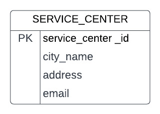| 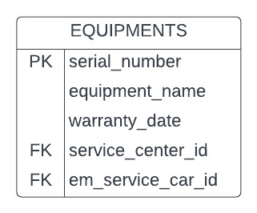| 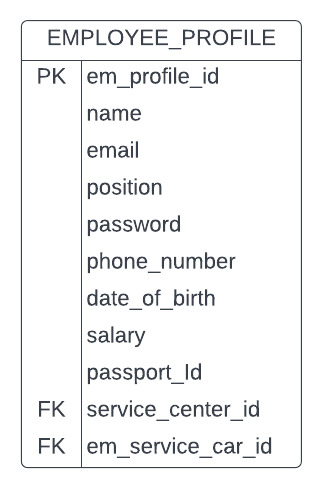|
|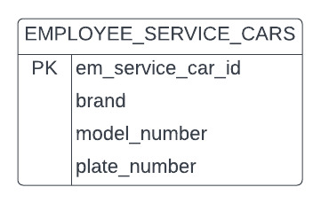| 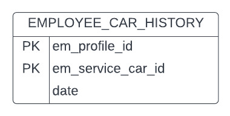| 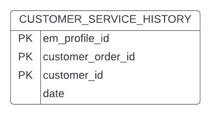|
|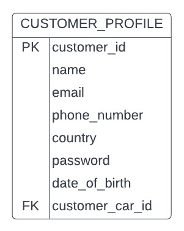| 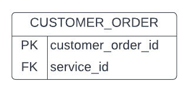| 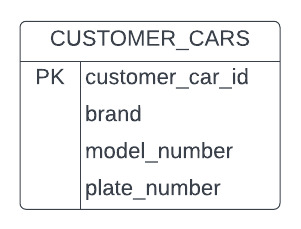|
|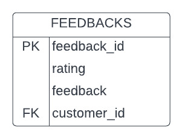| 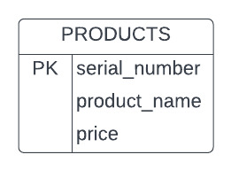| 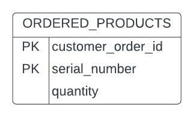|
|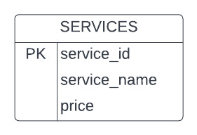| 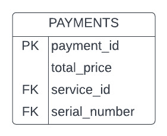| |

## ER Diagram
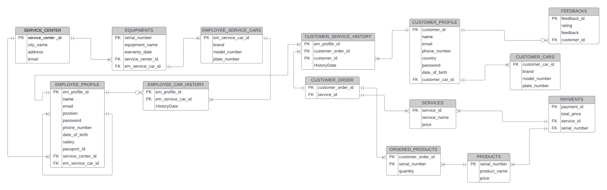

## Logic Data Model
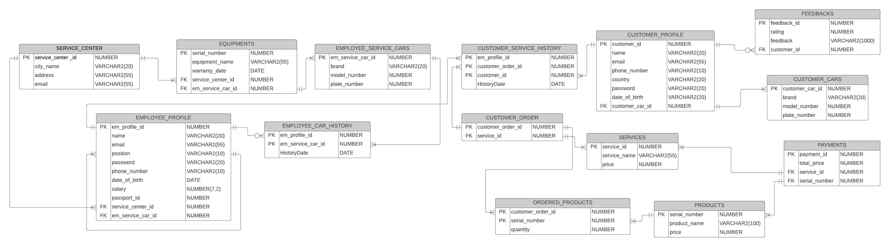

## Relationship Diagram 
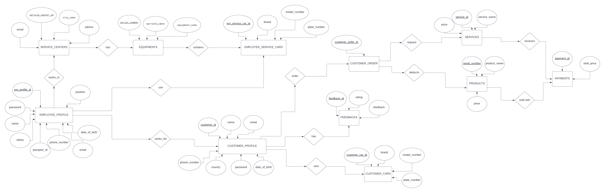

## Relationship Matrix  
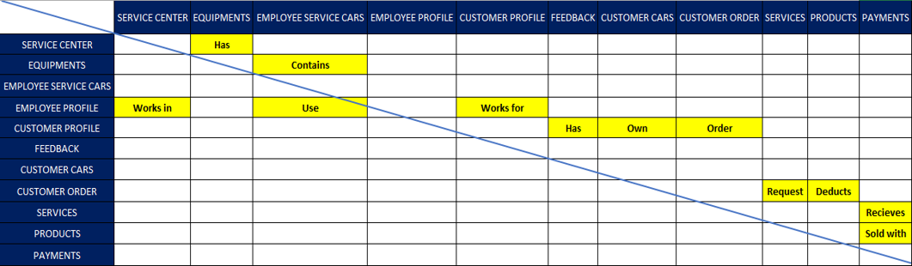

## First Normalization Form 
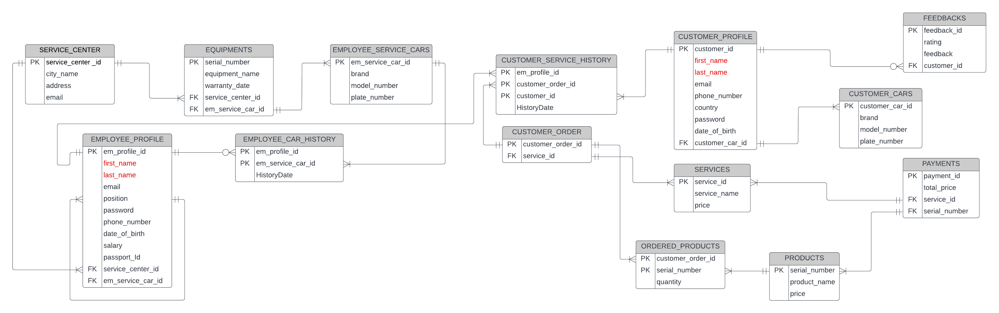

## Second Normalization Form 
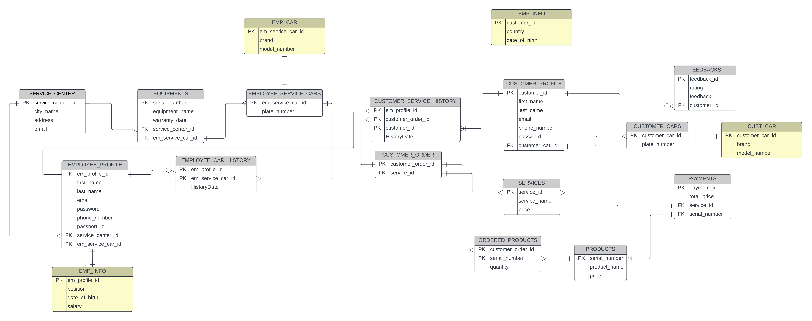
## Third Normalization Form 

## SQL code

```sql 
-- Service Center
CREATE TABLE SERVICE_CENTER (
    service_center_id  number,
    city_name          varchar2(20) not null,
    address            varchar2(55) not null,
    email              varchar2(55) not null unique,
    constraint pk_service_center primary key (service_center_id)
);

-- Equiments
CREATE TABLE EQUIPMENTS (
    serial_number  number,
    equiment_name  varchar2(55) not null,
    warranty_date  Date not null,
    service_center_id  number not null,
    constraint pk_equiments primary key (serial_number),  
    constraint fk_service foreign key (service_center_id) references SERVICE_CENTER (service_center_id)
);

-- Employee Service Car
CREATE TABLE EMPLOYEE_SERVICE_CARS (
    em_service_car_id  number,
    plate_number       number not null unique,
    constraint pk_service_car primary key (em_service_car_id)
);

-- Employee Car
CREATE TABLE EMP_CAR (
    em_service_car_id    number,  
    brand              varchar2(20) not null,  
    model_number       number not null,  
    constraint pk_emp_car primary key (em_service_car_id)
);

-- Employee Profile
CREATE TABLE EMPLOYEE_PROFILE (
    em_profile_id  number,
    first_name     varchar2(20) not null,  
    last_name      varchar2(20) not null, 
    email          varchar2(55) not null unique,
    position       varchar2(10) not null,
    password       varchar2(20) not null unique,
    phone_number   varchar2(10) not null unique,
    date_of_birth  date not null,
    salary         number(7,2) not null,
    passport_Id    number not null unique,
    service_center_id  number not null,
    em_service_car_id  number not null,
    constraint pk_employee_profile primary key (em_profile_id),  
    constraint fk_service_center foreign key (service_center_id) references service_center (service_center_id),
    constraint fk_service_car foreign key (em_service_car_id) references employee_service_cars (em_service_car_id)
);

-- Customer Cars
CREATE TABLE CUSTOMER_CARS (
    customer_car_id    number,   
    plate_number       number not null unique,
    constraint pk_customer_cars primary key (customer_car_id)
);

-- Customer Car
CREATE TABLE CUST_CAR (
    customer_car_id    number,  
    brand              varchar2(20) not null,  
    model_number       number not null,  
    constraint pk_cust_car primary key (customer_car_id)
);

-- Customer Profile
CREATE TABLE CUSTOMER_PROFILE (
    customer_id    number,  
    first_name     varchar2(20) not null,  
    last_name      varchar2(20) not null, 
    email          varchar2(55) unique,  
    phone_number   varchar2(10) not null unique,
    country        varchar2(20) not null,
    password       varchar2(20) not null unique,
    date_of_birth  Date,
    customer_car_id  number not null,
    constraint pk_customer_profile primary key (customer_id),  
    constraint fk_customer_cars foreign key (customer_car_id) references customer_cars (customer_car_id)
);

-- Feedbacks
CREATE TABLE FEEDBACKS (
    feedback_id  number,
    rating       number,
    feedback     varchar2(1000),
    customer_id  number,
    constraint pk_feedbacks primary key (feedback_id),       
    constraint fk_customer_profile foreign key (customer_id) references CUSTOMER_PROFILE (customer_id)
);

-- Service
CREATE TABLE SERVICES (
  service_id    number,
  service_name  varchar2(55) not null,
  price         number not null,
  constraint pk_service primary key (service_id)
);

-- Customer Order
CREATE TABLE CUSTOMER_ORDER (
    customer_order_id  number,
    service_id         number not null,
    constraint pk_customer_order primary key (customer_order_id),        
    constraint fk_services foreign key (service_id) references services (service_id)
);

-- Products
CREATE TABLE PRODUCTS (
    serial_number  number,
    product_name   varchar2(100) not null,
    price          number not null,
    constraint pk_products primary key(serial_number)
);

-- Payments
CREATE TABLE PAYMENTS (
  payment_id number,
  total_price  number not null,
  service_id   number,
  serial_number number,
  constraint pk_payments primary key (payment_id),
  constraint fk_services_payments foreign key (service_id) references services (service_id),
  constraint fk_serial_number foreign key (serial_number) references products (serial_number)
);

-- Employee Car History (Associative Entity)
CREATE TABLE EMPLOYEE_CAR_HISTORY(
    em_profile_id      number not null,
    em_service_car_id  number not null,
    HistoryDate        date not null,
    constraint FK_em_profile_id foreign key (em_profile_id) references EMPLOYEE_PROFILE(em_profile_id),
    constraint FK_em_service_car_id foreign key (em_service_car_id) references EMPLOYEE_SERVICE_CARS(em_service_car_id)
);

-- Customer Service History (Associative Entity)
CREATE TABLE CUSTOMER_SERVICE_HISTORY(
    em_profile_id      number not null,
    customer_order_id  number not null,
    customer_id        number not null,
    HistoryDate        date not null,
    constraint FK_em_profile foreign key (em_profile_id) references EMPLOYEE_PROFILE(em_profile_id),
    constraint FK_customer_order foreign key (customer_order_id) references CUSTOMER_ORDER(customer_order_id),
    constraint FK_customer foreign key (customer_id) references CUSTOMER_PROFILE(customer_id)
);

-- Ordered Products (Associative Entity)
CREATE TABLE ORDERED_PRODUCTS(
    customer_order_id  number not null,
    serial_number      number not null,
    quantity           number not null,
    constraint serial_number foreign key (serial_number) references PRODUCTS(serial_number),
    constraint customer_order_id foreign key (customer_order_id) references CUSTOMER_ORDER(customer_order_id)
);


-- Insert data into Service Center relation
INSERT INTO SERVICE_CENTER VALUES
(01, 'Abu dhabi', 'Al Danah', 'servicecarad@gmail.com');
INSERT INTO SERVICE_CENTER VALUES
(02, 'Dubai', 'Jumeirah', 'servicecardxb@gmail.com');

-- Insert data into Equiments relation
INSERT INTO EQUIPMENTS VALUES
(156343, 'Air Compressor', DATE '2022-12-31', 01);
INSERT INTO EQUIPMENTS VALUES
(673821, 'Vehicle Lift', DATE '2022-12-31', 02);
INSERT INTO EQUIPMENTS VALUES
(134853, 'Jack stands', DATE '2022-11-30', 01);
INSERT INTO EQUIPMENTS VALUES
(456374, 'Oil caddy', DATE '2022-11-30', 02);
INSERT INTO EQUIPMENTS VALUES
(765894, 'Oil drain', DATE '2025-12-31', 01);
INSERT INTO EQUIPMENTS VALUES
(678908, 'Battery charger', DATE '2025-12-31', 02);
INSERT INTO EQUIPMENTS VALUES
(145314, 'Engine hoist', DATE '2023-12-31', 01);
INSERT INTO EQUIPMENTS VALUES
(134654, 'Hoover Pressure Washer', DATE '2023-12-31', 02);
INSERT INTO EQUIPMENTS VALUES
(363533, 'Strut compressor', DATE '2022-6-13', 01);
INSERT INTO EQUIPMENTS VALUES
(235622, 'Air conditioning machine', DATE '2022-6-13', 02);


-- Insert data into Employee Service Car relation
INSERT INTO EMPLOYEE_SERVICE_CARS VALUES
(001, 16284);
INSERT INTO EMPLOYEE_SERVICE_CARS VALUES
(002, 87426);
INSERT INTO EMPLOYEE_SERVICE_CARS VALUES
(003, 28393);
INSERT INTO EMPLOYEE_SERVICE_CARS VALUES
(004, 63782);
INSERT INTO EMPLOYEE_SERVICE_CARS VALUES
(005, 23345);
INSERT INTO EMPLOYEE_SERVICE_CARS VALUES
(006, 45643);
INSERT INTO EMPLOYEE_SERVICE_CARS VALUES
(007, 56743);
INSERT INTO EMPLOYEE_SERVICE_CARS VALUES
(008, 23488);

-- Insert data into Employee Car relation
INSERT INTO EMP_CAR VALUES
(001, 'Nissan', 2019);
INSERT INTO EMP_CAR VALUES
(002, 'Nissan', 2019);
INSERT INTO EMP_CAR VALUES
(003, 'Nissan', 2019);
INSERT INTO EMP_CAR VALUES
(004, 'Nissan', 2019);
INSERT INTO EMP_CAR VALUES
(005, 'Nissan', 2019);
INSERT INTO EMP_CAR VALUES
(006, 'Nissan', 2019);
INSERT INTO EMP_CAR VALUES
(007, 'Nissan', 2019);
INSERT INTO EMP_CAR VALUES
(008, 'Nissan', 2019);

-- Insert data into Employee Profile relation
INSERT INTO EMPLOYEE_PROFILE VALUES
(2165, 'John', 'Johnson', 'garnett2010@hotmail.com', 'Labor', 'azae4Quea', '0503928234', DATE '1984-01-31', 3000, 990742632, 01, 001);
INSERT INTO EMPLOYEE_PROFILE VALUES
(6473, 'Michael', 'Martin', 'hermann1978@yahoo.com', 'Labor', 'Dee6ua7ekai', '0506108851', DATE '1968-09-18', 3000, 608874318, 01, 002);
INSERT INTO EMPLOYEE_PROFILE VALUES
(9287, 'Gregory', 'Martinez', 'bailey1990@yahoo.com', 'Labor', 'Zi3oGh3mo2fah','0505464887', DATE '1973-08-07', 3000, 294782221, 01, 003);
INSERT INTO EMPLOYEE_PROFILE VALUES
(6735, 'Francisco', 'Westra', 'treie1972@hotmail.com', 'Supervisor', 'weiGh6exie', '0585654887', DATE '1982-04-5', 3500, 408422083, 01, 004);
INSERT INTO EMPLOYEE_PROFILE VALUES
(8273, 'Michael', 'Gustin', 'halli5.oconne@hotmail.com', 'Labor', 'viiSh5latee','0556170992', DATE '1975-02-10', 3000, 782634582, 02, 005);
INSERT INTO EMPLOYEE_PROFILE VALUES
(4567, 'Danial', 'Ratliff', 'jadyn2008@hotmail.com', 'Supervisor', 'Upuequ3Bo2','0551489597', DATE '1965-01-11', 3500, 279834604, 02, 006);
INSERT INTO EMPLOYEE_PROFILE VALUES
(4325, 'John', 'Tuttle', 'franz2002@gmail.com', 'Labor', 'Xoor4ucoox','0551253678', DATE '1956-11-04', 3000, 342317084, 02, 007);
INSERT INTO EMPLOYEE_PROFILE VALUES
(7845, 'Thomas', 'Riddick', 'randi_kuhi4@gmail.com', 'Labor', 'ohshoKo9aew','0583567825', DATE '1961-03-10', 3000.00, 697857818, 02, 008);

-- Insert data into Customer Cars relation
INSERT INTO CUSTOMER_CARS VALUES
(001, 12768);
INSERT INTO CUSTOMER_CARS VALUES
(002, 18739);
INSERT INTO CUSTOMER_CARS VALUES
(003, 28373);
INSERT INTO CUSTOMER_CARS VALUES
(004, 35624);
INSERT INTO CUSTOMER_CARS VALUES
(005, 75623);
INSERT INTO CUSTOMER_CARS VALUES
(006, 25475);
INSERT INTO CUSTOMER_CARS VALUES
(007, 27832);
INSERT INTO CUSTOMER_CARS VALUES
(008, 98732);
INSERT INTO CUSTOMER_CARS VALUES
(009, 47328);
INSERT INTO CUSTOMER_CARS VALUES
(010, 62946);

-- Insert data into Customer Car relation
INSERT INTO CUST_CAR VALUES
(001, 'Honda', 2020);
INSERT INTO CUST_CAR VALUES
(002, 'Infiniti', 2021);
INSERT INTO CUST_CAR VALUES
(003, 'Toyota', 2018);
INSERT INTO CUST_CAR VALUES
(004, 'Audi', 2022);
INSERT INTO CUST_CAR VALUES
(005, 'BMW', 2011);
INSERT INTO CUST_CAR VALUES
(006, 'Land Rover', 2016);
INSERT INTO CUST_CAR VALUES
(007, 'Ford', 2011);
INSERT INTO CUST_CAR VALUES
(008, 'Jeep', 2016);
INSERT INTO CUST_CAR VALUES
(009, 'GMC', 2018);
INSERT INTO CUST_CAR VALUES
(010, 'Infiniti', 2022);

-- Insert data into Customer Profile relation
INSERT INTO CUSTOMER_PROFILE VALUES
(5321, 'Glenn',  'Robinson', 'ellis_wiega@hotmail.com', '0503928234', 'United States', 'jaf3booCoh', DATE '1997-11-05', 001);
INSERT INTO CUSTOMER_PROFILE VALUES
(5276, 'Thomas', 'Smith', 'janiya.brow2@gmail.com', '0505678234', 'Japan', 'kwnFD4588P', DATE '1992-09-04', 002);
INSERT INTO CUSTOMER_PROFILE VALUES
(5829, 'Joseph', 'Thies', 'liana19751983@yahoo.com', '0503926534', 'England', 'MW7q469AwY', DATE '1970-01-23', 003);
INSERT INTO CUSTOMER_PROFILE VALUES
(5872, 'Stanford', 'Brown', 'alicia1991@yahoo.com', '0503928546', 'Egypt', '2yc3LRRx4R', DATE '1985-03-07', 004);
INSERT INTO CUSTOMER_PROFILE VALUES
(5928, 'Bill', 'Pettway', 'theron1988@hotmail.com', '0557548234', 'Italy', 'jdsfsdiofh', DATE '1962-02-06', 005);
INSERT INTO CUSTOMER_PROFILE VALUES
(5920, 'Catherine', 'Voss', 'geovanni_johns@hotmail.com', '0578098234', 'chiko slovakia', 'isduhfuidf', DATE '1984-11-30', 006);
INSERT INTO CUSTOMER_PROFILE VALUES
(5372, 'Nicole', 'Barnes', 'jeanette1995@gmail.com', '0549058234', 'United States', 'duy8djbfis', DATE '1996-09-30', 007);
INSERT INTO CUSTOMER_PROFILE VALUES
(5332, 'David', 'Peake', 'noah.padber2@yahoo.com', '0558908234', 'United Kingdom', '32uiuudsc', DATE '2000-04-12', 008);
INSERT INTO CUSTOMER_PROFILE VALUES
(5778, 'Fred', 'Brink', 'moie2015@yahoo.com', '0501348335', 'United Kingdom', '87hbfdsfs', DATE '1990-02-06', 009);
INSERT INTO CUSTOMER_PROFILE VALUES
(5980, 'Denise', 'Bricker', 'marta_labad@gmail.com', '0556927893', 'England', 'ihbndiuf8', DATE '1994-12-09', 010);

-- Insert data into Feedbacks relation
INSERT INTO FEEDBACKS VALUES
(01, 9, 'Good job', 5321);
INSERT INTO FEEDBACKS VALUES
(02, 10, 'Excellent work', 5276);
INSERT INTO FEEDBACKS VALUES
(03, 10, 'Excellent work', 5872);
INSERT INTO FEEDBACKS VALUES
(04, 8, 'Good job', 5372);
INSERT INTO FEEDBACKS VALUES
(05, 9, 'I like your work, good job', 5980);

-- Insert data into services relation
INSERT INTO SERVICES VALUES
(742, 'Car Oil Change', 100);
INSERT INTO SERVICES VALUES
(712, 'Car Tinting', 500);
INSERT INTO SERVICES VALUES
(772, 'Car Recovery', 300);
INSERT INTO SERVICES VALUES
(735, 'Car Wash', 30);
INSERT INTO SERVICES VALUES
(752, 'Flat Battery', 80);
INSERT INTO SERVICES VALUES
(124, 'Wheel Alignment', 95);
INSERT INTO SERVICES VALUES
(351, 'Car AC Repair', 250);
INSERT INTO SERVICES VALUES
(764, 'Flat Tyre', 150);

-- Insert data into customer order relation
INSERT INTO CUSTOMER_ORDER VALUES
(78932,351);
INSERT INTO CUSTOMER_ORDER VALUES
(78293,712);
INSERT INTO CUSTOMER_ORDER VALUES
(67394,735);
INSERT INTO CUSTOMER_ORDER VALUES
(87349,712);
INSERT INTO CUSTOMER_ORDER VALUES
(37682,742);
INSERT INTO CUSTOMER_ORDER VALUES
(38745,712);
INSERT INTO CUSTOMER_ORDER VALUES
(34567,735);
INSERT INTO CUSTOMER_ORDER VALUES
(23456,764);
INSERT INTO CUSTOMER_ORDER VALUES
(23893,735);
INSERT INTO CUSTOMER_ORDER VALUES
(34856,712);
INSERT INTO CUSTOMER_ORDER VALUES
(32458,735);
INSERT INTO CUSTOMER_ORDER VALUES
(23487,712);
INSERT INTO CUSTOMER_ORDER VALUES
(32845,351);

-- Insert data into products relation
INSERT INTO PRODUCTS VALUES
(126, 'Turtle Wax Trim Restoree', 73.95);
INSERT INTO PRODUCTS VALUES
(675, 'DAX TIRE GLOW 500ML', 26.25);
INSERT INTO PRODUCTS VALUES
(245, 'STP MULTI PURPOSE MOTOR TREATMENT 16OZ', 51.45);
INSERT INTO PRODUCTS VALUES
(876, 'GOOD STUFF RIMS DETAILER 500ML', 59.50);
INSERT INTO PRODUCTS VALUES
(295, 'MCKEES 37 CERAMIC DETAIL SPRAY 22OZ', 99.25);

-- Insert data into payments relation
INSERT INTO PAYMENTS VALUES
(0001, 126.25, 742, 675);
INSERT INTO PAYMENTS (payment_id, total_price, service_id) VALUES
(0002, 30, 735);
INSERT INTO PAYMENTS VALUES
(0003, 139.5, 752, 876);
INSERT INTO PAYMENTS VALUES
(0004, 223.95, 764, 126);
INSERT INTO PAYMENTS VALUES
(0005, 56.25, 735, 675);
INSERT INTO PAYMENTS (payment_id, total_price, service_id) VALUES
(0006, 500, 712);
INSERT INTO PAYMENTS (payment_id, total_price, serial_number) VALUES
(0007, 124.25,295);

-- Insert data into Employee Car History relation
INSERT INTO EMPLOYEE_CAR_HISTORY VALUES 
(2165, 002, DATE '2022-5-29');
INSERT INTO EMPLOYEE_CAR_HISTORY VALUES 
(6473, 001, DATE '2022-5-20');
INSERT INTO EMPLOYEE_CAR_HISTORY VALUES 
(9287, 004, DATE '2022-5-29');
INSERT INTO EMPLOYEE_CAR_HISTORY VALUES 
(6735, 003, DATE '2022-5-1');
INSERT INTO EMPLOYEE_CAR_HISTORY VALUES 
(8273, 006, DATE '2022-5-25');
INSERT INTO EMPLOYEE_CAR_HISTORY VALUES 
(4567, 005, DATE '2022-5-15');
INSERT INTO EMPLOYEE_CAR_HISTORY VALUES 
(4325, 007, DATE '2022-5-22');
INSERT INTO EMPLOYEE_CAR_HISTORY VALUES 
(7845, 008, DATE '2022-5-29');

-- Insert data into Customer Service History relation
INSERT INTO CUSTOMER_SERVICE_HISTORY VALUES 
(2165, 78932, 5321, DATE '2022-4-29');
INSERT INTO CUSTOMER_SERVICE_HISTORY VALUES 
(2165, 32845, 5276, DATE '2022-5-15');
INSERT INTO CUSTOMER_SERVICE_HISTORY VALUES 
(6473, 67394, 5829, DATE '2022-3-20');
INSERT INTO CUSTOMER_SERVICE_HISTORY VALUES 
(9287, 37682, 5872, DATE '2022-5-20');
INSERT INTO CUSTOMER_SERVICE_HISTORY VALUES 
(6735, 38745, 5928, DATE '2022-5-2');
INSERT INTO CUSTOMER_SERVICE_HISTORY VALUES 
(8273, 34567, 5920, DATE '2022-5-25');
INSERT INTO CUSTOMER_SERVICE_HISTORY VALUES 
(4567, 23893, 5372, DATE '2022-5-15');
INSERT INTO CUSTOMER_SERVICE_HISTORY VALUES 
(4325, 34856, 5332, DATE '2022-3-13');
INSERT INTO CUSTOMER_SERVICE_HISTORY VALUES 
(7845, 32458, 5778, DATE '2022-3-2');
INSERT INTO CUSTOMER_SERVICE_HISTORY VALUES 
(7845, 23487, 5980, DATE '2022-5-29');

-- Insert data into Ordered Products relation
INSERT INTO ORDERED_PRODUCTS VALUES 
(78932, 126, 2);
INSERT INTO ORDERED_PRODUCTS VALUES 
(32845, 675, 1);
INSERT INTO ORDERED_PRODUCTS VALUES 
(67394, 245, 1);
INSERT INTO ORDERED_PRODUCTS VALUES 
(37682, 876, 1);
INSERT INTO ORDERED_PRODUCTS VALUES 
(38745, 295, 1);
INSERT INTO ORDERED_PRODUCTS VALUES 
(34567, 876, 2);
INSERT INTO ORDERED_PRODUCTS VALUES 
(23893, 295, 1);
INSERT INTO ORDERED_PRODUCTS VALUES 
(34856, 126, 1);
INSERT INTO ORDERED_PRODUCTS VALUES 
(32458, 295, 1);
INSERT INTO ORDERED_PRODUCTS VALUES 
(23487, 675, 1);


-- Show All tables
SELECT * FROM SERVICE_CENTER;
SELECT * FROM EQUIPMENTS;
SELECT * FROM EMPLOYEE_SERVICE_CARS;
SELECT * FROM EMP_CAR;
SELECT * FROM EMPLOYEE_PROFILE;
SELECT * FROM CUSTOMER_CARS;
SELECT * FROM CUST_CAR;
SELECT * FROM CUSTOMER_PROFILE;
SELECT * FROM FEEDBACKS;
SELECT * FROM SERVICES;
SELECT * FROM CUSTOMER_ORDER;
SELECT * FROM PRODUCTS;
SELECT * FROM PAYMENTS;
SELECT * FROM EMPLOYEE_CAR_HISTORY;
SELECT * FROM CUSTOMER_SERVICE_HISTORY;
SELECT * FROM ORDERED_PRODUCTS;


-- Service Center relation JOIN Equipments relation
SELECT * FROM SERVICE_CENTER sc INNER JOIN EQUIPMENTS e ON sc.service_center_id=e.service_center_id;

-- Service Center relation JOIN Employee Profile relation
SELECT * FROM SERVICE_CENTER sc INNER JOIN EMPLOYEE_PROFILE ep ON sc.service_center_id=ep.service_center_id;

-- Employee Profile relation JOIN Employee Car History relation
SELECT * FROM EMPLOYEE_PROFILE ep INNER JOIN EMPLOYEE_CAR_HISTORY ech ON ep.em_profile_id=ech.em_profile_id;

-- Employee Service Car relation JOIN Employee Car History relation
SELECT * FROM EMPLOYEE_SERVICE_CARS esc INNER JOIN EMPLOYEE_CAR_HISTORY ech ON esc.em_service_car_id=ech.em_service_car_id;

-- Employee Profile relation JOIN Customer Service History relation
SELECT * FROM EMPLOYEE_PROFILE ep INNER JOIN CUSTOMER_SERVICE_HISTORY csh ON ep.em_profile_id=csh.em_profile_id;

-- Customer Profile relation JOIN Customer Service History relation
SELECT * FROM CUSTOMER_PROFILE cp INNER JOIN CUSTOMER_SERVICE_HISTORY csh ON cp.customer_id=csh.customer_id;

-- Customer Profile relation JOIN Feedbacks relation
SELECT * FROM CUSTOMER_PROFILE cp INNER JOIN FEEDBACKS f ON cp.customer_id=f.customer_id;

-- Customer Cars relation JOIN Customer Profile relation
SELECT * FROM CUSTOMER_CARS cc INNER JOIN CUSTOMER_PROFILE cp ON cc.customer_car_id=cp.customer_car_id;

-- Customer Order relation JOIN Customer Service History  relation
SELECT * FROM CUSTOMER_ORDER co INNER JOIN CUSTOMER_SERVICE_HISTORY csh ON co.customer_order_id=csh.customer_order_id;

-- Service JOIN Customer Order relation
SELECT * FROM SERVICES s INNER JOIN CUSTOMER_ORDER co ON s.service_id=co.service_id;

-- Ordered Products JOIN Customer Order relation
SELECT * FROM ORDERED_PRODUCTS op INNER JOIN CUSTOMER_ORDER co ON op.customer_order_id=co.customer_order_id;

-- Service JOIN Payments relation
SELECT * FROM SERVICES s INNER JOIN PAYMENTS p ON s.service_id=p.service_id;

-- Products JOIN Ordered Products  relation
SELECT * FROM PRODUCTS pr INNER JOIN ORDERED_PRODUCTS op ON pr.serial_number=op.serial_number;

-- Products JOIN Payments relation
SELECT * FROM PRODUCTS pr INNER JOIN PAYMENTS p ON pr.serial_number=p.serial_number;

```


## Survey

> Figure 1 - Drivers mostly tend to wash there cars weekly if not monthly.


> Figure 2 - Car services shows to be important and mostly drivers recieve them each 6 months.

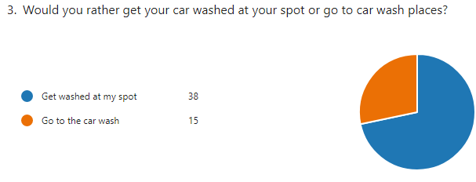
> Figure 3 - Getting serviced from home is what most drivers need.

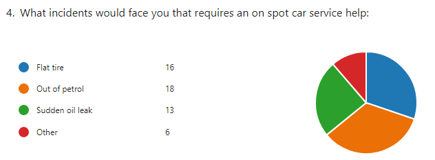
> Figure 4 - Stats shows how important is to have flexible on spot servicing for different scenarios.


> Figure 5 - Stats shows that getting information like email and phone number is acceptable for registering in our system.


> Figure 6 - Car owners want to know who engaged in servicing there car. 